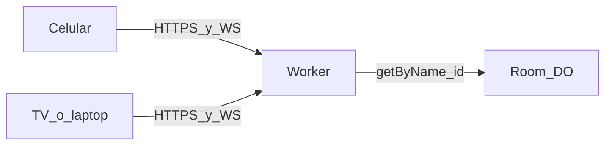

# Ping Pong Tournament Implementation Plan

> **For agentic workers:** REQUIRED SUB-SKILL: Use **superpowers:subagent-driven-development** to implement this plan task-by-task. Steps use checkbox (`- [ ]`) syntax for tracking.

**Goal:** Página web en español donde un grupo de amigos arma un torneo de ping pong (llave + randomize) o un marcador suelto, y el mismo estado se mueve en vivo desde varios dispositivos via un link.

**Architecture:** Worker sirve el SPA y enruta HTTP/WebSocket a un Durable Object `Room` por id de sala. La lógica de nombres, llave, sets y undo vive en funciones puras (`src/domain/*`) para TDD sin runtime de Workers. El DO persiste JSON, hiberna WebSockets y es la única fuente de verdad. El cliente no aplica puntos en local.

**Tech stack:** TypeScript, Vite + `@cloudflare/vite-plugin`, Wrangler, Durable Objects (SQLite-backed class, `storage.put` de un blob), Vitest (node para dominio, `@cloudflare/vitest-pool-workers` para DO), HTML/CSS/vanilla TS (sin React). UI copy en español.

## Global Constraints

- Spec: [docs/superpowers/specs/2026-08-29-ping-pong-tournament-design.md](../specs/2026-08-29-ping-pong-tournament-design.md)
- Sin login, PIN ni roles; cualquiera con el link edita
- Torneo: eliminación directa, 2–16 jugadores, byes automáticos tras Fisher–Yates
- Reglas: 1 set / mejor de 3 / mejor de 5; puntos 7 u 11; **siempre ganar por 2**
- Default de creación: mejor de 3, a 11
- Randomizar se desactiva en cuanto **cualquier partido real** tiene un punto (byes no cuentan)
- Sin QR, 3er puesto, saque, round-robin, D1, historial
- Expiración lazy: 30 días sin **escrituras** → 404 y `deleteAll`
- UI español; modo **Operate** (impeccable): el marcador y la llave son la tarea, no marketing
- Mundo visual: **no inventar paleta/tipo antes de Task 9**. Task 8 = cliente funcional sin identidad. Task 9 = elección de mundo con impeccable
- `wrangler types` genera `Env`; no escribir a mano la interfaz de bindings
- `compatibility_date` al día del scaffold; `nodejs_compat`; `wrangler.jsonc`

---

## Execution: Subagent-Driven Development

Este plan se ejecuta con **subagent-driven-development**. Un subagente fresco por task; review de spec + calidad después de cada task; review amplio al final.

### Pre-flight (controller, antes de Task 1)

1. `git init` si no hay repo (proyecto greenfield)
2. Crear rama `feat/ping-pong-tournament` (no implementar en `main` sin consentimiento)
3. Ledger: `.superpowers/sdd/progress.md` (git-ignored scratch)
4. Leer spec + Global Constraints una vez
5. Escanear el plan por contradicciones (ninguna conocida: Task 8 sin identidad → Task 9 impeccable)

### Por cada Task N (Tasks 1–11)

```
1. BASE=$(git rev-parse HEAD)
2. node .cursor/plugins/.../subagent-driven-development/scripts/task-brief \
     docs/superpowers/plans/2026-08-29-ping-pong-tournament.md N
3. Dispatch implementer (generalPurpose) con:
   - brief path
   - report path: .superpowers/sdd/task-N-report.md
   - scene-setting (1 párrafo)
   - interfaces de tasks previas (solo lo que el brief no cubre)
   - model explícito (ver tabla abajo)
4. Implementer: TDD, tests, commit, report (status + commits + test summary)
5. node .../scripts/review-package BASE HEAD  → review diff path
6. Dispatch task reviewer con: brief, report, review package, Global Constraints
7. Si spec ❌ o Important/Critical: fix subagent → re-review
8. Append ledger: Task N: complete (commits <base>..<head>, review clean)
9. Siguiente task sin pausar (excepto Task 9 — ver gate humano)
```

### Model selection (implementer)

| Task | Model | Razón |
|------|-------|-------|
| 1 | composer-2.5-fast | Scaffold mecánico |
| 2 | composer-2.5-fast | Tipos, transcripción |
| 3–6 | composer-2.5 | Dominio TDD, lógica pura |
| 7 | inherit | DO + Worker, integración |
| 8 | inherit | Cliente multi-vista + WS |
| 9 | inherit | Diseño + código (impeccable) |
| 10 | inherit | Finish + documentación |
| 11 | composer-2.5 | Checklist manual |

Reviewers: composer-2.5 mínimo; Task 7 reviewer = inherit.

### Task 9 — gate humano (impeccable)

Task 9 **pausa** hasta que el usuario elija dirección visual (concept-seed + challengers + canon). No auto-elegir la dirección asignada si el usuario está presente.

### Task 10–11 — finish

- Task 10: subagent con skill **impeccable** (finish-reviewer + documenter)
- Task 11: controller verifica checklist spec
- Final: **requesting-code-review** whole-branch + **finishing-a-development-branch**

### Tasks con impeccable (no subagent genérico solo)

| Task | Skill | Referencias |
|------|-------|-------------|
| 1 | impeccable init | `reference/init.md` → PRODUCT.md |
| 9 | impeccable new-work | `reference/new-work.md`, `reference/operate.md`, `reference/craft-floor.md` |
| 10 | impeccable finish | finish-reviewer, documenter, `reference/document.md` |

---

## File structure

- Create: `PRODUCT.md` — verdad de producto (impeccable init), sin paleta
- Create: `package.json`, `wrangler.jsonc`, `vite.config.ts`, `tsconfig.json`, `vitest.config.ts`, `vitest.workers.config.ts`, `.gitignore`
- Create: `src/domain/types.ts`, `names.ts`, `shuffle.ts`, `bracket.ts`, `match.ts`, `room.ts`
- Create: `src/id.ts`, `src/room-do.ts`, `src/worker.ts`
- Create: `src/client/index.html`, `main.ts`, `api.ts`, `views/*.ts`, `styles.css`
- Create: `test/domain/*.test.ts`, `test/workers/room.test.ts`
- Later: `DESIGN.md` + sidecar **solo en Task 10** (impeccable documenter)



---

### Task 1: Scaffold + PRODUCT.md

**Subagent:** implementer + reviewer. **Impeccable:** init → PRODUCT.md.

**Files:**
- Create: `PRODUCT.md`, `package.json`, `wrangler.jsonc`, `vite.config.ts`, `tsconfig.json`, `vitest.config.ts`, `.gitignore`

**Interfaces:**
- Consumes: spec §2, §7, §12
- Produces: app `ping-pong`, binding `ROOMS` → class `Room`, `npm test` = domain vitest

- [ ] **Step 1:** Escribir `PRODUCT.md` (schema `impeccable:product-schema 1`): Platform `web`; Stack `delegated: Vite + Workers + Durable Objects`; Users = amigos en garage/club, celular en la mesa, a veces TV; Purpose = torneo single-elim + marcador compartido por URL; Positioning = sala en vivo sin cuentas; Constraints = spec; Brand = “Ping Pong”, voz directa en español; Evidence = ninguno; Principles = servidor manda, un toque = un punto, llave legible a 2 m; A11y = targets grandes, contraste AA, bye vs partido no solo por color.
- [ ] **Step 2:** Scaffold Vite + `@cloudflare/vite-plugin` + `wrangler.jsonc`:

```jsonc
{
  "name": "ping-pong",
  "main": "src/worker.ts",
  "compatibility_date": "2026-08-29",
  "compatibility_flags": ["nodejs_compat"],
  "durable_objects": {
    "bindings": [{ "name": "ROOMS", "class_name": "Room" }]
  },
  "migrations": [{ "tag": "v1", "new_sqlite_classes": ["Room"] }]
}
```

- [ ] **Step 3:** `.gitignore`: `node_modules`, `dist`, `.wrangler`, `.dev.vars`, `.superpowers`
- [ ] **Step 4:** `npx wrangler types`; `npm test` pasa
- [ ] **Step 5:** Commit: `chore: scaffold Cloudflare worker and PRODUCT.md`

---

### Task 2: Types

**Files:**
- Create: `src/domain/types.ts`

**Produces:** tipos estables para el resto del plan.

```ts
export type MatchType = "one_set" | "best_of_3" | "best_of_5";
export type PointsTo = 7 | 11;
export type RoomMode = "tournament" | "scoreboard";
export type MatchStatus = "pending" | "in_progress" | "completed";
export type Side = "a" | "b";

export interface Rules {
  pointsTo: PointsTo;
  matchType: MatchType;
}

export interface Player {
  id: string;
  name: string;
}

export interface MatchSnapshot {
  pointsA: number;
  pointsB: number;
  setsA: number;
  setsB: number;
  status: MatchStatus;
  winnerId: string | null;
}

export interface Match {
  id: string;
  round: number;
  slot: number;
  playerAId: string | null;
  playerBId: string | null;
  winnerId: string | null;
  state: MatchSnapshot;
  undoStack: MatchSnapshot[];
}

export interface Bracket {
  size: 2 | 4 | 8 | 16;
  matches: Match[];
}

export interface Room {
  id: string;
  mode: RoomMode;
  createdAt: number;
  lastWrittenAt: number;
  rules: Rules;
  players: Player[];
  bracket: Bracket | null;
  scoreboardMatch: Match | null;
  activeMatchId: string | null;
  championId: string | null;
}

export type Command =
  | { type: "point"; matchId: string; side: Side; delta: 1 | -1 }
  | { type: "undo"; matchId: string }
  | { type: "openMatch"; matchId: string }
  | { type: "randomize" }
  | { type: "resetScoreboard" };

export type ApplyErrorCode =
  | "not_found"
  | "expired"
  | "invalid"
  | "match_not_ready"
  | "randomize_locked"
  | "undo_blocked";
```

- [ ] **Step 1:** Añadir tipos
- [ ] **Step 2:** Commit: `feat: add room and match domain types`

---

### Task 3: Nombres

**Files:**
- Create: `src/domain/names.ts`
- Test: `test/domain/names.test.ts`

**Produces:**
- `normalizeName(raw: string): string`
- `uniqueNames(names: string[]): string[]`
- `assertPlayerCount(n: number, mode: RoomMode): void`

- [ ] **Step 1: Write the failing test**

```ts
import { describe, it, expect } from "vitest";
import { uniqueNames, assertPlayerCount } from "../../src/domain/names";

it("añade sufijos a duplicados ignorando mayúsculas", () => {
  expect(uniqueNames(["Ana", "ana", "Beto"])).toEqual(["Ana", "Ana 2", "Beto"]);
});

it("rechaza torneo fuera de 2–16", () => {
  expect(() => assertPlayerCount(1, "tournament")).toThrow();
  expect(() => assertPlayerCount(17, "tournament")).toThrow();
});
```

- [ ] **Step 2:** `npx vitest run test/domain/names.test.ts` — FAIL
- [ ] **Step 3:** Implementar `names.ts`
- [ ] **Step 4:** PASS
- [ ] **Step 5:** Commit: `feat: unique player names and roster limits`

---

### Task 4: Shuffle + colocación de llave

**Files:**
- Create: `src/domain/shuffle.ts`, `src/domain/bracket.ts`
- Test: `test/domain/bracket.test.ts`

**Produces:**
- `shuffle<T>(items: T[], rng: () => number): T[]`
- `bracketSize(n: number): 2 | 4 | 8 | 16`
- `seedOrder(size: 2 | 4 | 8 | 16): number[]` — 8 → `[1,8,4,5,2,7,3,6]`
- `buildBracketFromOrder(players: Player[]): Bracket` — determinista para tests
- `buildBracket(players: Player[], rng: () => number): Bracket`
- `parentOf`, `sideInParent`, `hasAnyPlayedPoints`

Byes: promover de inmediato; 5 jugadores → size 8, 1 partido real ronda 1.

- [ ] **Step 1:** Tests deterministas (size, byes, seedOrder)
- [ ] **Step 2–4:** TDD + PASS
- [ ] **Step 5:** Commit: `feat: single-elim bracket with automatic byes`

---

### Task 5: Marcador (set / partido / undo)

**Files:**
- Create: `src/domain/match.ts`
- Test: `test/domain/match.test.ts`

**Produces:**
- `setsNeeded`, `isSetOver`, `applyPoint`, `undo`, `canOpen`

Tests: 11–9 cierra; 11–10 no; 12–10 cierra; Bo3 2–0; `−` en 0; undo.

- [ ] TDD completo
- [ ] Commit: `feat: ping-pong scoring with win-by-two and undo`

---

### Task 6: `applyCommand` a nivel sala

**Files:**
- Create: `src/domain/room.ts`
- Test: `test/domain/room.test.ts`

**Produces:**
- `createRoom`, `isExpired`, `applyCommand`

Reglas: randomize locked; advance winner; undo_blocked si padre jugado; resetScoreboard.

- [ ] Tests + commit: `feat: room commands advance bracket and lock randomize`

---

### Task 7: Durable Object + Worker

**Files:**
- Create: `src/room-do.ts`, `src/worker.ts`, `src/id.ts`
- Test: `test/workers/room.test.ts`, `vitest.workers.config.ts`

**Produces:**
- `newRoomId()` — 6 chars URL-safe
- DO: persist, RPC, WS hibernation, broadcast sin `undoStack`
- Worker: `POST/GET /api/rooms`, WS, SPA assets

- [ ] Worker tests PASS
- [ ] Commit: `feat: Room durable object with snapshot and websocket`

---

### Task 8: Cliente conectado (sin identidad visual)

**Files:**
- Create: `src/client/*` (home, setup, bracket, scoreboard, missing)

**Produces:** Rutas `/`, `/nuevo`, `/marcador`, `/t/:id`, marcador en vivo, banner “Sin conexión”, copy link.

CSS: usable, botones min 56px, **sin** paleta de marca.

- [ ] Manual: dos pestañas, un punto visible en ambas (`wrangler dev`)
- [ ] Commit: `feat: live client for tournament and scoreboard`

---

### Task 9: Mundo visual (impeccable) — GATE

**Subagent:** inherit + skill **impeccable** (new-work, operate, craft-floor).

No CSS de marca ni `DESIGN.md` antes de este task.

**Mode:** Operate. **Rut evitado:** SaaS esports, neon arcade, tenis verde/blanco.

- [ ] `node .cursor/skills/impeccable/scripts/context.mjs --target src/client/index.html`
- [ ] 7 candidatos del mundo real → `concept-seed.mjs --scope direction --mode operate`
- [ ] Presentar dirección + challengers + canon (Challonge-like); **usuario elige**
- [ ] visualize.md: 3 comps si hay image gen; usuario aprueba uno
- [ ] Contrato HTML en `body` (THESIS, OWN-WORLD, STORY, FIRST VIEWPORT, FORM + seed, FINISH)
- [ ] Restyle; motion 150–250ms solo estado
- [ ] Commit: `feat: apply chosen visual world to client`

---

### Task 10: Finish impeccable + DESIGN.md

**Subagent:** inherit + impeccable finish-reviewer + documenter.

- [ ] Screenshots desktop + mobile (home, setup, llave 5p, marcador, 404)
- [ ] `detect.mjs --json`; fix mecánicos
- [ ] finish-reviewer → fixes en un batch → recapture máx. 1
- [ ] documenter → `DESIGN.md` + sidecar
- [ ] Grep build por seed key del contrato
- [ ] Commit: `docs: record DESIGN.md from shipped UI`

---

### Task 11: Verificación de spec

Checklist contra [spec](../specs/2026-08-29-ping-pong-tournament-design.md):

- [ ] 2–16, byes, randomize locked, copy link, solo marcador + reset
- [ ] win by 2, 7/11, one set / Bo3 / Bo5
- [ ] undo bloqueado si siguiente partido tiene puntos
- [ ] 404 sala expirada/inexistente
- [ ] dos dispositivos sincronizados
- [ ] sin QR, sin login

---

## Spec coverage

| Spec | Tasks |
|------|-------|
| §3 modos | 6, 7, 8 |
| §4 pantallas | 8, 9 |
| §5 llave/byes | 4 |
| §6 marcador/undo | 5, 6 |
| §7 DO/WS | 7 |
| §8 modelo | 2 |
| §9 errores | 3, 6, 8 |
| §10 fuera v1 | — |
| Impeccable | 1, 9, 10 |

---

## Handoff

Plan guardado en este archivo. Ejecución: **subagent-driven-development** (recomendado).

Task 9 requiere elección visual del usuario antes de continuar.
